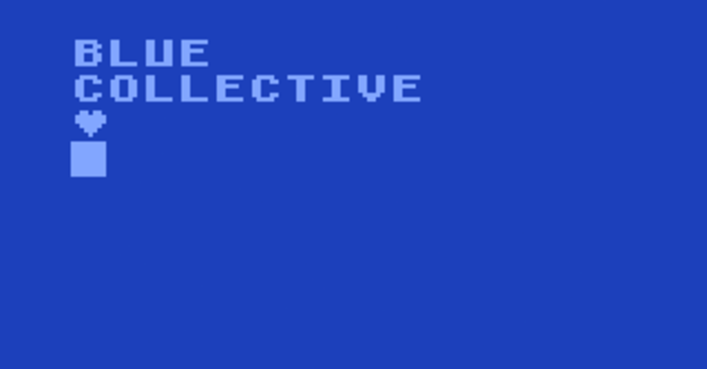
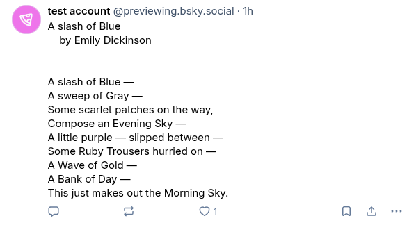
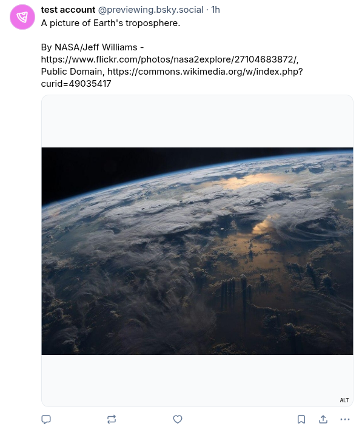
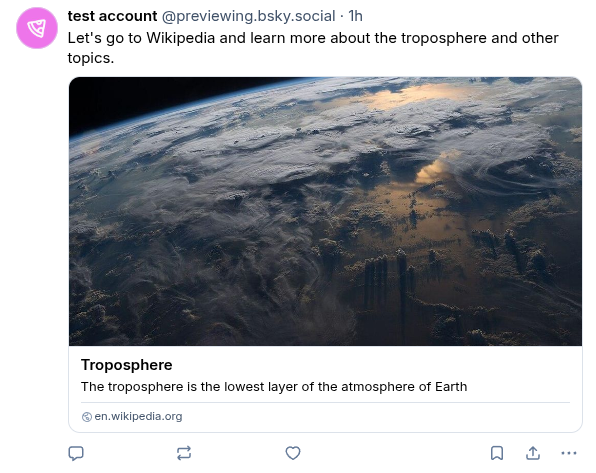

# blue-collective

Draft and review Bluesky posts together using GitHub.

Loosely inspired by https://github.com/twitter-together/action.




## Why drafting and reviewing using GitHub?

This can be useful for organizations, projects, and groups, that want/need to
post from time to time but where it would be clunky to share login/password and
where people are more comfortable posting if somebody else reviews their text.

This action leverages GitHub's code review so that you can draft together and
don't have to share the password.


## Quick start

1. Get a Bluesky **app password** at https://bsky.app/settings/privacy-and-security

2. Create a GitHub repository where you will draft the posts. Go to Settings ->
   Secrets and variables -> Actions -> Repository secrets and store there:
   - `BLUESKY_USERNAME` (typically YOURHANDLE.bsky.social)
   - `BLUESKY_APP_PASSWORD`
   (this is the app password you generated in the previous step). Instead of the
   app password you can also use your normal password but app password is more secure
   (see section "Password security").

3. Create a directory `posts` where you will draft your posts.  If you prefer a
   different name for the directory, change it also in the workflow below
   (`posts-directory`).

4. Create a file `.github/workflows/post.yml`:
```yaml
name: Post to Bluesky once merged

on:
  push:
    branches:
      - main
  pull_request:
    branches:
      - main

jobs:
  build:
    runs-on: ubuntu-latest
    steps:
    - name: Checkout
      uses: actions/checkout@v6
      with:
        fetch-depth: 0  # fetch full history so all refs exist

    - name: Dry run (only test limits)
      uses: bast/blue-collective@c7b50cc801da231327f172f1e76226d94d3a9300
      with:
        posts-directory: "posts"
        dry-run: true

      # the if check is to make sure the next step is only allowed to run once
      # the pull request is merged
    - name: Publish
      if: github.ref_name == github.event.repository.default_branch
      uses: bast/blue-collective@c7b50cc801da231327f172f1e76226d94d3a9300
      with:
        posts-directory: "posts"
      env:
        BLUESKY_USERNAME: ${{ secrets.BLUESKY_USERNAME }}
        BLUESKY_APP_PASSWORD: ${{ secrets.BLUESKY_APP_PASSWORD }}
```

5. Start drafting and merging posts.


## Which changes trigger new posts?

- The action looks for **new** markdown files below `posts`.
- It will only post the new markdown files if they were pushed to the default branch or
  merged to the default branch (typically from a pull request).
- Opening a pull request does not post anything (see also the section "Why is the action used in two steps?").
- It is possible to have several new markdown files and post them all at once but make sure
  they are either pushed in one commit or squashed before merged to the default branch.
- Modifying or removing existing markdown files does not generate new posts.
- The [code that detects new changes](src/detect_new_posts.py) queries Git and
  not the GitHub API. To decide whether a file is new it asks Git which files
  were **added**. Removing an old post and adding a very similar new post in
  one commit can appear to Git as **renaming** and such a post will not be
  posted.


## Why is the action used in two steps?

The first step does a dry run: Nothing gets posted but this is useful to check
whether text is not too long or an image not too large.  It would be annoying
to detect this once the pull request is merged.

The above workflow will trigger a dry run on any open pull request.

However, you don't want to post to Bluesky on every unmerged pull request
otherwise anyone could post anything to your account.  This is why the second
step is behind this line:
```yaml
if: github.ref_name == github.event.repository.default_branch
```
Don't remove this line.


## How to organize posts in your repository

You can either have each post in its own directory:
```
posts
├── some-topic
│   └── post.md
├── 2025-11
│   └── post.md
├── 2025-12-05
│   ├── post.md
│   └── image.jpg
└── 2025-12-06
    ├── post.md
    └── funny-image.png
```

Or collect them all in one:
```
posts
├── some-topic.md
├── 2025-11.md
├── 2025-12-05.md
├── 2025-12-06.md
├── image.jpg
└── funny-image.png
```

You can also nest more directories if it helps:
```
posts
└── 2025
    ├── 11
    │   ├── another-topic.md
    │   └── some-topic.md
    └── 12
        ├── funny-image.png
        ├── funny-post.md
        ├── image.jpg
        └── serious-post.md
```

The naming of files and directories (below `posts`) does not matter.  Any `.md`
there is assumed to be a post. See examples below on how you can post more than
just text.


## Examples

### Only text

In this case the markdown file only contains text:
```md
A slash of Blue
    by Emily Dickinson


A slash of Blue —
A sweep of Gray —
Some scarlet patches on the way,
Compose an Evening Sky —
A little purple — slipped between —
Some Ruby Trousers hurried on —
A Wave of Gold —
A Bank of Day —
This just makes out the Morning Sky.
```

Result:




### Text with image

Here we need to provide the name of the image file (relative to the location of
the post markdown file) and an alt text (using YAML frontmatter markers):
```yaml
---
image: troposphere.jpg
alt: A picture of Earth's troposphere
---

A picture of Earth's troposphere.

By NASA/Jeff Williams - https://www.flickr.com/photos/nasa2explore/27104683872/,
Public Domain, https://commons.wikimedia.org/w/index.php?curid=49035417
```

Result:



You can also fetch an image from the web:
```yaml
---
image: https://picsum.photos/200
alt: unfortunately not sure which image we get
---

It is possible to fetch an image from the web.
```

### Text with a social card

Text with a social card can be useful for posts about events or conferences.

Example:
```yaml
---
title: Troposphere
description: The troposphere is the lowest layer of the atmosphere of Earth
uri: https://en.wikipedia.org/wiki/Troposphere
image: troposphere.jpg
---

Let's go to Wikipedia and learn more about the troposphere and other topics.
```

Result:




## Password security

It is better to use the Bluesky **app** password than the actual password.  The
reason is that if the password ever leaks, you can expire it. With an app
password nobody can lock you out of your Bluesky account and the worst that
they could do is to post to it until you expire it.

But how safe is it to send the Bluesky app password to this action? What if the
action gets compromised and emails the app password to somewhere?

To verify that this is not happening you can verify the source code.

And by using the actual commit hash you make sure that the action cannot silently change
without you noticing:
```yaml
uses: bast/blue-collective@c7b50cc801da231327f172f1e76226d94d3a9300
```

This also means that when updating to a later version, you can verify the code
before using a more recent commit hash.

If you are very worried, you could also fork this action and then you have full
control.


## Ideas for improvements?

Please open an issue! Ideas and improvements and bug-fixes most welcome.
